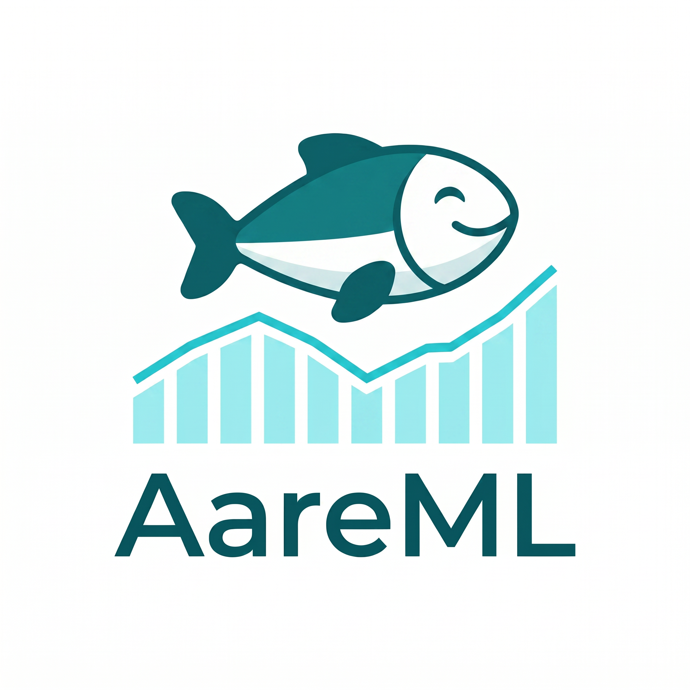

<div align="center">
  
</div>

# AareML

**Predicting River Water Quality in Swiss Catchments with Deep Learning**

CAS in Advanced Machine Learning · University of Bern · June 2026

[](LICENSE)
[](tests/test_src.py)
[](https://github.com/polar-bear-after-lunch/AareML)

---

## Overview

AareML applies a sequence-to-sequence LSTM to predict dissolved oxygen (DO) and water temperature at 14-day horizons across Swiss river gauges, using the [CAMELS-CH-Chem dataset](https://zenodo.org/records/14980027) (Nascimento et al., 2025). The model is benchmarked against [LakeBeD-US](https://essd.copernicus.org/articles/17/3141/2025/) (McAfee et al., 2025), validated across 12 Swiss gauges, tested on 4 US rivers, and extended to 21 Swiss lakes.

---

## Key Results

### Single-Site (Gauge 2473 — Aare at Bern)

| Model | DO RMSE | Temp RMSE | KGE | Notes |
|-------|---------|-----------|-----|-------|
| Persistence | 0.339 mg/L | 1.365°C | 0.930 | Baseline |
| Climatology | 0.334 mg/L | 1.444°C | 0.853 | Baseline |
| Ridge Regression | 0.303 mg/L | 1.261°C | 0.908 | Best RMSE |
| LSTM (default) | 0.308 mg/L | 1.267°C | 0.855 | — |
| **LSTM (best Optuna)** | **0.300 mg/L** | **1.345°C** | **0.942** | Best KGE |
| LakeBeD-US LSTM (ref.) | 1.40 mg/L | — | — | Published lake benchmark |

> LSTM wins on KGE (0.942 vs 0.908) — capturing the river's seasonal rhythm, not just its average level.

### Multi-Site DO Transfer (12 Swiss Gauges)

| Strategy | Mean RMSE | Significance |
|----------|-----------|-------------|
| Zero-shot transfer | 0.464 mg/L | p=0.024 vs Ridge (Wilcoxon, n=11) |
| Per-gauge retrain | 0.392 mg/L | p=0.465 (not significant) |
| EA-LSTM | 0.417 mg/L | — |

### Temperature Multi-Site (15 Gauges)
- Mean RMSE: **2.59°C** · Mean NSE: **0.730**
- Best gauge: 1.12°C (low-elevation) · Worst: 3.68°C (high-alpine)

### Cross-Continental Transfer (4 US Rivers — Zero Retraining)

| River | RMSE |
|-------|------|
| Willamette, OR | **0.996 mg/L** (beats lake benchmark) |
| Fox River, WI | 1.549 mg/L |
| Mississippi, LA | 1.678 mg/L |
| Missouri, MO | 1.874 mg/L |

### Swiss Lakes (Bärenbold et al. 2026 — 21 Lakes)

| Model | RMSE | NSE |
|-------|------|-----|
| River LSTM zero-shot → lake | 3.980 mg/L | -4.24 |
| **Lake-retrained LSTM** | **0.76 mg/L** | **0.708** |
| LakeBeD-US benchmark | 1.40 mg/L | — |

> Lake-retrained AareML **1.8× better** than published benchmark. Zero-shot river→lake transfer fails — lakes require domain-specific training.

### SHAP Attribution
- `temp_sensor[t-1]`: dominant driver (mean |SHAP| = 0.644)
- `O2C_sensor[t-1]`: second (0.527)
- Effective LSTM memory: 3–4 days despite 21-day lookback
- The AI rediscovered Henry's Law purely from data

---

## Setup

### 1. Clone
```bash
git clone https://github.com/polar-bear-after-lunch/AareML.git
cd AareML
```

### 2. Create environment
```bash
conda create -n aareml python=3.11 -y
conda activate aareml
conda install -c conda-forge llvmlite numba -y
pip install -r requirements.txt
```

### 3. Download data (~360 MB + Swiss lakes)
```bash
python download_data.py              # all datasets
python download_data.py --camels     # CAMELS-CH-Chem only (~165 MB)
python download_data.py --lake       # LakeBeD-US only (~194 MB)
python download_data.py --swiss-lakes # Bärenbold 2026 Swiss lakes
```

> **Note:** USGS data (notebook 08) downloads automatically at runtime via `dataretrieval`.

### 4. Run notebooks in order

```
01_data_exploration.ipynb          — EDA, 14 figures
02_baselines.ipynb                 — Persistence, Climatology, Ridge
03_lstm_single_site.ipynb          — Seq2Seq LSTM + 75 Optuna trials + 3-seed ensemble
04_multisite_analysis.ipynb        — Zero-shot + per-gauge + EA-LSTM (DO, 12 gauges)
04b_multisite_temperature.ipynb    — Temperature multi-site (15 gauges)
05_shap_interpretation.ipynb       — GradientSHAP attribution
06_cross_ecosystem_lake.ipynb      — River vs Lake Mendota (LakeBeD-US)
07_lake_eda.ipynb                  — Lake Mendota EDA
08_usgs_transfer.ipynb             — Cross-continental transfer (4 US rivers)
09_canton_zurich_analysis.ipynb    — Canton Zurich DO analysis + stress map
10_swiss_lakes_lstm.ipynb          — Swiss lakes EDA + LSTM (Bärenbold 2026)
```

### 5. UBELIX HPC
```bash
bash sync_to_ubelix.sh             # push code to UBELIX
# On UBELIX:
python download_data.py            # download all datasets
bash ubelix/setup_env.sh           # set up conda environment (first time)
cd ubelix && sbatch run_all.sh     # submit full pipeline (03→04→04b→05→08→10)
bash fetch_from_ubelix.sh          # pull results back to Mac
```

---

## Repository Structure

```
AareML/
├── notebooks/
│   ├── 01_data_exploration.ipynb
│   ├── 02_baselines.ipynb
│   ├── 03_lstm_single_site.ipynb
│   ├── 04_multisite_analysis.ipynb
│   ├── 04b_multisite_temperature.ipynb
│   ├── 05_shap_interpretation.ipynb
│   ├── 06_cross_ecosystem_lake.ipynb
│   ├── 07_lake_eda.ipynb
│   ├── 08_usgs_transfer.ipynb
│   ├── 09_canton_zurich_analysis.ipynb
│   └── 10_swiss_lakes_lstm.ipynb
├── src/
│   ├── config.py      — Shared config (LOOKBACK=21, HORIZON=14)
│   ├── data.py        — Data loading, preprocessing, windowing
│   ├── metrics.py     — RMSE, MAE, NSE, KGE, bootstrap CI
│   ├── model.py       — Seq2SeqLSTM, EA-LSTM, NSE+MSE loss, checkpoints
│   └── impute.py      — SAITS self-attention imputer
├── ubelix/
│   ├── run_all.sh          — Submit full job chain (03→04→04b→05→08→10)
│   ├── job_03_lstm.sh
│   ├── job_04_multisite.sh
│   ├── job_04b_temp.sh
│   ├── job_05_shap.sh
│   ├── job_08_usgs.sh
│   ├── job_10_lakes.sh
│   ├── setup_env.sh        — Conda env setup
│   └── test_local.sh       — Smoke test (CPU)
├── tests/
│   └── test_src.py         — 53 pytest tests (all passing)
├── figures/
│   ├── aareml_logo.png     — Project logo
│   ├── 09_zh_river_heat_map.png
│   ├── transfer_learning_diagram.png
│   └── ...39 total figures
├── results/                — CSVs, checkpoints, Optuna study
├── data/                   — Data directory (git-ignored)
├── download_data.py        — Downloads all datasets
├── sync_to_ubelix.sh       — rsync Mac → UBELIX
├── fetch_from_ubelix.sh    — rsync UBELIX → Mac
├── AareML-report.pdf       — Full technical report (v1.12, 31 pages)
├── AareML-canton-zurich.pdf — Canton Zurich standalone chapter
├── AareML-plain-language.pdf      — Plain-language summary (English)
├── AareML-plain-language-ru.pdf   — Plain-language summary (Russian)
├── AareML-presentation.pptx      — 19-slide presentation (May 2026)
├── requirements.txt
└── CHANGELOG.md
```

---

## Testing

```bash
cd AareML
python -m pytest tests/test_src.py -v
# 53 tests, all passing
```

---

## Data

Data is excluded due to size. Use `python download_data.py` to fetch all datasets.

| Dataset | Size | Source |
|---------|------|--------|
| CAMELS-CH-Chem | ~165 MB | [Zenodo](https://zenodo.org/records/14980027) |
| LakeBeD-US (Lake Mendota) | ~194 MB | [Hugging Face](https://huggingface.co/datasets/eco-kgml/LakeBeD-US-CSE) |
| Swiss Lakes (Bärenbold 2026) | ~123 MB | [Eawag Open Data](https://opendata.eawag.ch/dataset/long-term-temperature-oxygen-and-water-clarity-trends-in-swiss-lakes) |
| USGS NWIS (NB08) | auto | Downloaded at runtime via `dataretrieval` |

---

## Version History

See [CHANGELOG.md](CHANGELOG.md) for full history (v1.0–v1.25).
**Current version: v1.17** (May 2026)

---

## Citation

If you use this code, please cite:

- Nascimento et al. (2025). CAMELS-CH-Chem. *Zenodo*. https://doi.org/10.5281/zenodo.14980027
- McAfee et al. (2025). LakeBeD-US. *ESSD*, 17, 3141–3170. https://doi.org/10.5194/essd-17-3141-2025
- Bärenbold et al. (2026). Swiss Lakes long-term dataset. *Eawag Open Data*. https://doi.org/10.25678/0009KJ

---

## License

MIT — see [LICENSE](LICENSE).

*AI assistance (Perplexity Computer) was used for code scaffolding, report drafting, and data exploration. All scientific interpretations are the author's own.*
